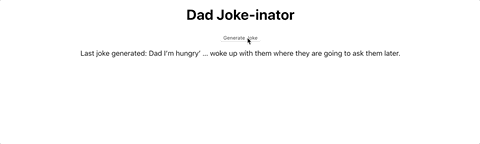

# Dad Joke-inator

This app creates new dad jokes using existing dad jokes and Markov chains.

Visit dad-joke-inator.herokuapp.com to create new dad jokes!

## Demo

## Tech Used

Built with:

- [React](https://reactjs.org/)
- [Node.js](https://nodejs.org/en/)
- [Express](https://expressjs.com/)
- [Axios](https://github.com/axios/axios)
- [icanhazdadjoke API](https://icanhazdadjoke.com/)
- [titlegen](https://github.com/namuol/titlegen) - Library to handle Markov chain generation

## Installation

Prerequisites:

- npm

Steps:

- Clone this project (https://github.com/Lysautumn/dad-joke-generator.git) to your local machine
- `cd` into the project
- Run `npm install` to install required dependencies
- Open a second terminal window in the same directory
- Run `npm run server` in one terminal window
- Run `npm run client` in the second terminal window, this should open http://localhost:3000/ in your browser.

## Roadmap

In the future, features I would like to implement are:

- CSS styling
- Change Markov chain configuration to get less nonsensical jokes

## Credits

Thank you to Raymond Camden for his blog post ["Generating Random Cure Song Titles with Markov Chain"](https://www.raymondcamden.com/2018/01/16/generating-random-cure-song-titles), for laughs and titlegen library recommendation.
